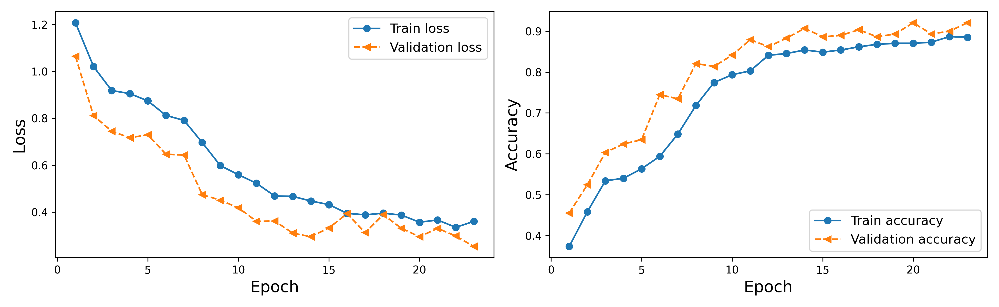
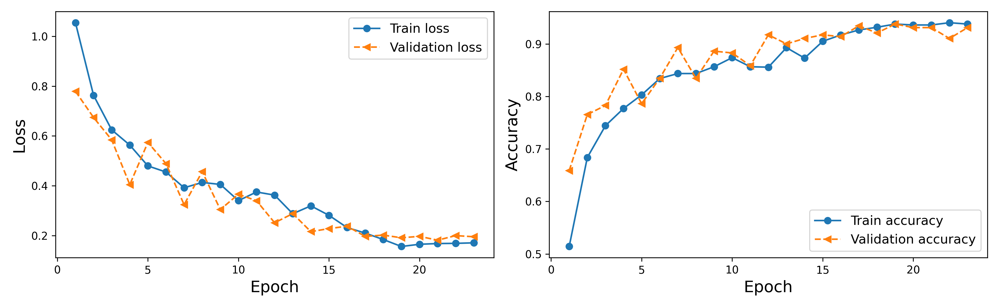
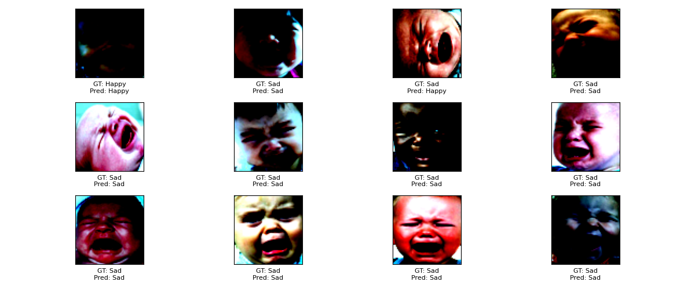

# Infant Emotion Recognition.

This repository contains code for building and training a Convolutional Neural Network (CNN) and a Residual Neural Network(ResNet) from scratch, to classify images in the **BabyFace** dataset. The project demonstrates deep learning techniques using PyTorch, including dataset preprocessing, model training, evaluation, and inference.

## Prerequisites

Before running the code, ensure you have the following dependencies installed:

- Python  
- PyTorch  
- torchvision  
- scikit-learn  
- matplotlib  

You can install these dependencies using pip:

```bash
pip install torch torchvision scikit-learn matplotlib
```

## Dataset

The **BabyFace** dataset comprises **1,814** images of infant facial expressions. It combines **134** images from the Tromsø Infant Face Database with **1,680**  scrapped images from YouTube videos featuring infants aged **4 to 12 months**. The dataset is categorized into three primary emotional states:

- **Happy:** 619 images  
- **Sad:** 567 images  
- **Neutral:** 628 images  

Although the dataset provides a relatively balanced representation of emotions, **70% of the images feature White infants**, with limited representation from other racial groups. This racial imbalance is due to the availability of infant facial expression datasets and the scarcity of publicly accessible images of Black and other non-White infants.

🔗 **Download the dataset:** [BabyFace Dataset](https://drive.google.com/drive/folders/1hOa0vpw69RvMer_AtGLDZtspyfLAhYiS)


## Model Architecture

For this project, two models were built and trained: a CNN with a residual connection and a ResNet model implemented from scratch. The ResNet model could be either ResNet-18 or ResNet-32, but for this task, a ResNet-18 was trained. Both models performed well during training, as observed in the learning curve plots. The optimal model choice would depend on the task's Bayes error and the number of trainable parameters, i.e., the model's size.

## Output Visualization

The following figures are the learning curve plots for both models, showing the loss and accuracy trends for the training and validation datasets:

**CNN Learning Curve:**



**ResNet-18 Learning Curve:**



## Inference Output

During inference on the unseen test dataset, the CNN model achieved an accuracy of **91.46%**, while the ResNet-18 model achieved **92.29%**. Below is a visualization of the ResNet-18 inference output, showing the **ground truth labels** and **predicted labels**:



